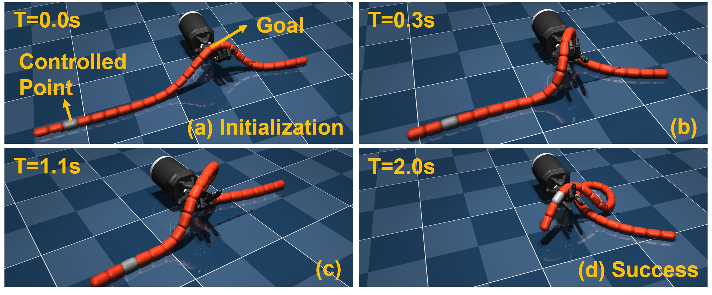

# 2024

## [*DexDLO: Learning Goal-Conditioned Dexterous Policy for Dynamic Manipulation of Deformable Linear Objects*](https://arxiv.org/html/2312.15204v1) \(ICRA2024\) (Source codes will release soon)

**Sun Zhaole**, Jihong Zhu, Robert B. Fisher

```Learning to use an anthropomorphic hand (a five-fingered hand) to manipulate deformable linear objects (ropes, cables, tubes, etc) in MuJoCo```




# 2023

## [*A Robust Deformable Linear Object Perception Pipeline in 3D: From Segmentation to Reconstruction*](https://ieeexplore.ieee.org/document/10333979) \(IEEE RA-L\) [*Source code*](https://github.com/TheGoblinTechies/DLO-perception-pipeline)

**Sun Zhaole**, Hang Zhou, Li Nanbo, Longfei Chen, Jihong Zhu, Robert B. Fisher

```A pipeline to segment, reconstruction, and physically smooth the 3D ropes with occlusions and self-intersections ```


# 2021

## [*Object-centric representation learning with generative spatial-temporal factorization*](https://proceedings.neurips.cc/paper/2021/file/593906af0d138e69f49d251d3e7cbed0-Paper.pdf) \(Neurips2021\)

Nanbo Li, Muhammad Ahmed Raza, Wenbin Hu, **Sun Zhaole**, Robert Fisher


# 2020

## [*Learning Pregrasp Manipulation of Objects from Ungraspable Poses*](https://ieeexplore.ieee.org/document/9196982)  \(ICRA2020\)

**Sun Zhaole**, Kai Yuan, Wenbin Hu, Chuanyu Yang, Zhibin Li

```Changing the object's pose to make them graspable```


To see the 8-page version on [*Arxiv*](https://arxiv.org/abs/2002.06344)